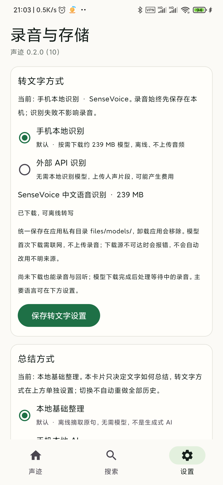
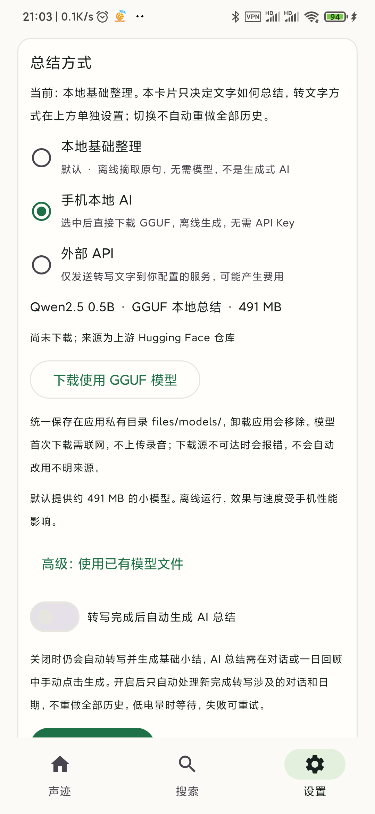
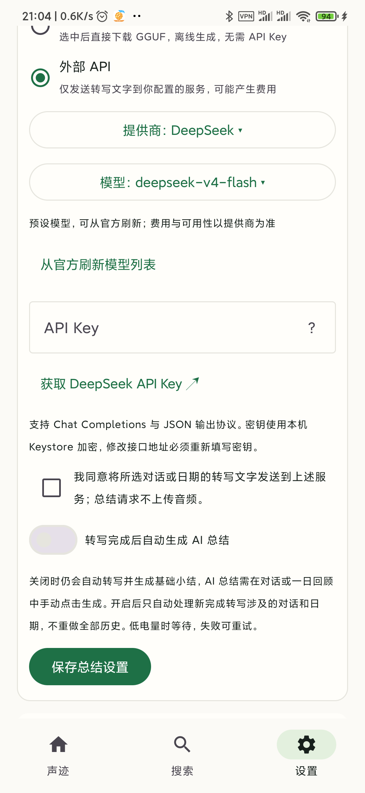

# 声迹 Sonfolio

声迹是一款面向 Android 的本地优先语音记录应用。它把持续录音整理成可以阅读、搜索和回听的对话时间线，帮助你找回聊过的事情、临时想到的点子，以及一天里值得记住的内容。录音、语音检测、转写和基础整理默认在手机上完成，不需要账号或自建后端；外部语音识别和生成式 AI 总结都由你选择是否启用。

项目目前处于早期试用阶段，已具备录音到转写、检索和回听的完整链路，但全天后台运行、长期数据积累和真实本地 AI 总结仍在完善与验证中。它适合愿意参与测试的个人用户和开发者，还不适合作为重要记录的唯一保存方式。正式客户端位于 `android/`，仓库根目录的网页是交互原型，不具备 Android 后台录音能力。

## 界面预览

以下是 Android 真机上的设置界面，不含私人录音、转写或密钥。从左到右分别是：转文字方式、本地 AI 模型下载、外部总结服务。转文字和总结独立选择；常用提供商无需手填接口地址。

<p>
  
  
  
</p>

## 从录音到可以回看的记忆

打开应用并点击“开始记录”后，声迹通过前台服务持续录音，每五分钟保存一个原音文件，已完成的文件进入本地语音检测与转写队列。你可以继续录音，同时查看已经保存的原音和处理进度；处理完成后，文字会自动整理到时间线中，不需要连接开发电脑触发。文件切片不等于对话边界：相邻语音会按时间间隔和已知录音缺口合并或分开，一场对话可以跨越多个录音文件。

- **按日期回看**：浏览对话主题、本段小结和一日回顾，查看当天已保存的录音与处理状态。
- **对照原音**：在对话详情里展开转写，点击某一行跳到对应录音；底部播放器支持暂停续播和拖动进度。
- **留下重点**：录音时使用默认 3／10／20 分钟回溯标记，按钮直接显示分钟数，三个时长均可在设置中修改；高亮涉及的连续对话，目前按时间连续性判断，不是语义主题识别。
- **搜索与筛选**：用关键词搜索标题和转写，按今天、本周或仅标记筛选；结果按「每场对话」一张卡片展示最匹配的一句与命中句数，未输入关键词时列出最新对话；短录音可按有效人声时长与文字量共同过滤，隐藏不等于删除原音。
- **处理状态可见**：录音处理分「保存原音 → 找人声 → 转写 → 整理对话」四步；首页时间线按每场对话出卡，卡片右上角用状态灯显示进度，还没整理完的录音按同一场对话规则临时成组显示，并可在「最近两周」卡片查看当日整理进度与中断缺口。
- **可选本地识别引擎**：在设置里按需下载 SenseVoice（239 MB，默认）或 Qwen3-ASR 0.6B int8（约 987 MB，中英混说与方言更强），两者可随时切换，互不替换。
- **个人词汇（热词）**：修正转写时出现的专有名词会进入候选，你确认或多次命中后加入个人词汇，用于本地 Qwen3-ASR 的识别提示；不会自动写入，也不上传。

## 安装与开始使用

目前支持 **Android 10 及以上、arm64-v8a 设备**，尚未提供正式 Release 安装包，可从源码构建 Debug APK 试用。构建需要 Git、Git LFS、JDK 17，以及 Android SDK Platform 35、NDK `29.0.14206865` 和 CMake `3.31.6`；可在 Android Studio 中打开 `android/` 配置 SDK。首次构建需要联网取得依赖和固定版本的 llama.cpp 源码，VAD／ASR 模型随项目的 Git LFS 资源获取，生成式总结模型不会自动下载。

```bash
git clone https://github.com/gongfpp/Sonfolio.git
cd Sonfolio
git lfs install
git lfs pull
cd android
./gradlew :app:assembleDebug
```

生成的安装包位于 `android/app/build/outputs/apk/debug/app-debug.apk`。将 APK 传到手机安装，或在上述 `android/` 目录内通过已连接的 ADB 设备安装：

```bash
adb install -r app/build/outputs/apk/debug/app-debug.apk
```

首次打开时允许麦克风权限，并在系统请求时允许通知权限，以便查看录音状态和使用通知栏标记。先在“设置 → 转文字方式”下载本地识别模型，或选择外部识别提供商并确认音频上传；没有模型也能先录音和回听。录音停止后在“原始录音”中确认保存与回听，再等待转写出现在时间线上。默认优先识别中文，可在设置中调整主要语言、短录音过滤阈值和处理条件；不同手机的后台限制不同，长时间使用前请先确认锁屏后仍在采集。

## 转文字方式

“转文字方式”位于“总结方式”上方，两者独立选择：可以本地转写、外部总结，也可以外部转写、本地整理。

| 方式 | 如何开始 | 音频去向 |
| --- | --- | --- |
| 手机本地识别（默认） | 在卡片内选择并下载本地识别引擎：SenseVoice int8（239 MB）或 Qwen3-ASR 0.6B int8（约 987 MB） | 本机离线处理，不上传 |
| 外部 API 识别 | 下拉选择千问或硅基流动及语音模型，点击官方 API Key 链接创建密钥，填入并确认上传 | 本机先检测人声，再把短人声片段发送给所选提供商，可能产生费用 |

外部识别只自动处理保存设置之后开始的录音，历史音频需在原音列表逐份点击“继续处理”并确认。不会因启用外部文字总结而获得音频上传授权。当前云端时间戳采用本地人声窗口，并非逐字对齐；硅基流动接口自动判断语言，不支持强制指定主要语言。云端接口接入不等于已经对各服务识别质量作出保证。

## 总结方式由你选择

默认的“本地基础整理”不需要联网，也不需要额外下载大语言模型：它从转写中提取主题、要点和可能的安排。你也可以在设置中选择“手机本地 AI”或“外部 API”，让模型生成对话小结、结构化内容和日记式一日回顾。自动 AI 总结默认关闭，转写与总结都可能出现错误，重要内容应通过原文和原音核对。

| 方式 | 需要准备什么 | 数据在哪里处理 |
| --- | --- | --- |
| 本地基础整理 | 无额外配置 | 手机本地，采用提取式规则 |
| 手机本地 AI | 选中后点击“下载使用 GGUF 模型” | 手机本地，需要额外存储与内存；效果、速度和长内容处理仍待验收 |
| 外部 API | 下拉选择 DeepSeek／千问和模型，填入 API Key 并确认发送文字 | 总结请求仅包含转写文字、整理提示及必要上下文，不上传音频 |

内置下载选项为约 491 MB 的 Qwen2.5-0.5B-Instruct Q4_K_M。识别与总结模型都优先从大陆可访问的镜像下载，镜像失败才回退上游；每个文件都会先做 SHA-256 校验，校验通过后才启用。下载校验完成后启用手机本地 AI；若期间另存了总结配置，不会覆盖你的新选择。识别和总结的大模型均不打进 APK，下载文件统一保存在应用私有 `files/models/` 目录。已有兼容 GGUF 的高级用户仍可展开导入入口，普通用户无需寻找模型文件。常用外部提供商无需输入接口地址，API Key 字段下方可直达官方创建页面，文本模型列表可手动从官方刷新；自定义接口只放在高级选项中。

## 原音、隐私与存储

原音和转写默认保存在应用的本地私有空间，不内置云端账户同步。默认本地识别不上传音频；外部转文字需要单独的音频上传确认，外部总结需要文字发送确认。两套 API Key 分开用 Android Keystore 加密保存，不写入数据导出。应用禁用系统云备份，并声明排除云备份与设备迁移的数据规则，仍需注意不同系统的实现差异。

当前原音采用 16 kHz 单声道 PCM WAV，包含静音时段，连续录音约占 **115 MB／小时、2.76 GB／天**，尚不自动压缩。设置中的永久／7 天／30 天目前用于保留期限提醒，不会自动删除到期录音；完整原音、有效人声和标记内容仍共用同一份音频。可用空间低于约 512 MB 时提示、低于约 64 MB 时停止录音并尝试收尾，不通过自动清理腾空间。

从设置进入“原始录音”，点击卡片进入回听页，长按开启多选，批量导出或清理。清理无声／已过滤原音会保留文字、总结和标记，并跳过受标记保护或尚未处理的文件；清理后该文件从原音列表和数量中移除。每页先显示 30 份，可点击查看更多。

设置中的完整备份可导出原音及转写、标记、对话关系，再恢复到空数据库；不包含 API Key、模型和个性化设置。备份文件目前未加密，请存放在可信位置。卸载应用、清除应用数据或设备损坏都可能造成记录丢失，请提前备份。

## 项目状态与参与开发

当前重点是录音长期运行可靠性、减少历史数据增长带来的整理与查询开销，以及完善用户可控的原音管理和备份恢复。说话人识别、声纹定向识别、语义搜索和自然语言历史问答尚未实现，嘈杂环境下的识别效果也仍需改进。若遇到问题，欢迎在 [GitHub Issues](https://github.com/gongfpp/Sonfolio/issues) 提供手机型号、Android 版本、应用版本和复现步骤；公开反馈不需要附上私人录音、完整转写或 API Key。

Android 客户端使用 Kotlin、Jetpack Compose、Room 和 WorkManager，语音链路采用 Silero VAD、SenseVoice／Qwen3-ASR 与 sherpa-onnx，本地生成式总结通过 llama.cpp 接入。技术选择与架构见 [技术说明](docs/technical-selection.md)，中英文识别质量集见 [评测目录](docs/evaluation/README.md)，已验证的范围和剩余问题见 [0.2.3 验收记录](docs/开发验收-0.2.3.md)，详细版本变更保留在 `docs/` 下的开发验收文档中。若只想查看网页交互原型，可在仓库根目录运行 `python3 -m http.server 4173` 后访问 `http://127.0.0.1:4173`；该页面只用于设计参考，不代表手机功能已完成验收。

## 许可证

除另有明确许可声明的第三方代码、模型和资源外，声迹 Sonfolio 采用 **GNU General Public License v3.0 only（SPDX：`GPL-3.0-only`）**，完整条款见 [LICENSE](LICENSE)。项目指定 GPL 第 3 版，不包含“或任意后续版本”的额外授权，也不附加“禁止商用”限制。

你可以使用、修改和商用声迹，包括收费分发。但分发受 GPL 约束的修改版或衍生作品时，必须继续按 GPL 授权，保留许可及版权声明、注明修改，并依许可向接收者提供对应源码和必要构建文件。仅在本地私下修改使用，不要求公开；发布修改版也不要求将修改合并回本仓库。以上是便于理解的说明，具体权利义务以许可证正文为准。软件不提供任何担保。

第三方代码、模型和运行库保留各自的许可证与归属，不因本项目采用 GPL 而被重新许可。随应用提供的许可文本位于 [许可证目录](android/app/src/main/assets/licenses)；贡献方式与许可边界见 [CONTRIBUTING.md](CONTRIBUTING.md)。正式 Release 发布前仍需完成第三方许可与源码对应关系检查，以及功能和隐私验收；指定许可证不代表这些验收已经完成。

SenseVoice 权重是用户可选下载的独立组件，适用 [FunASR 模型协议](https://github.com/modelscope/FunASR/blob/main/MODEL_LICENSE)，含使用限制，不属于客户端的 GPL-3.0 许可；其代码 MIT 许可不能代替权重许可。Qwen3-ASR 0.6B 权重来自 [Qwen/Qwen3-ASR-0.6B](https://huggingface.co/Qwen/Qwen3-ASR-0.6B)，采用 Apache-2.0 许可。应用下载前会展示并要求接受对应模型许可。Qwen2.5 下载模型采用其上游 Apache-2.0 许可。
