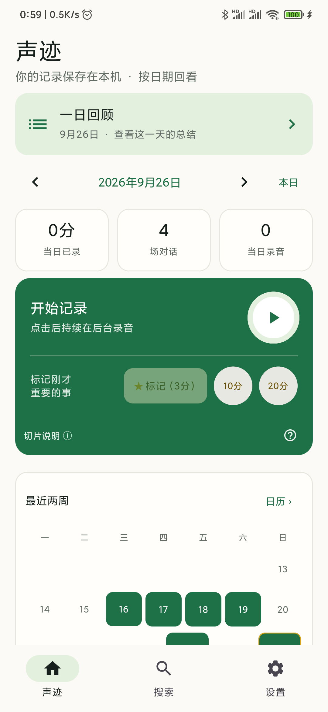
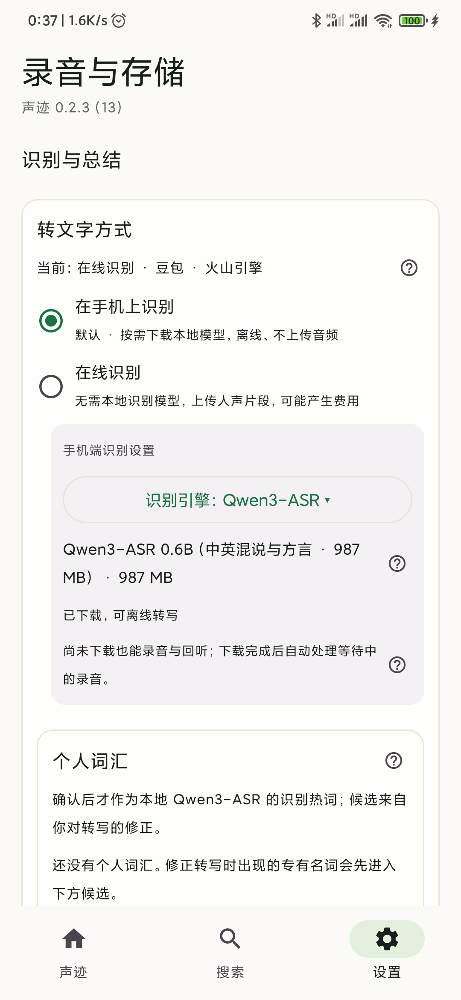
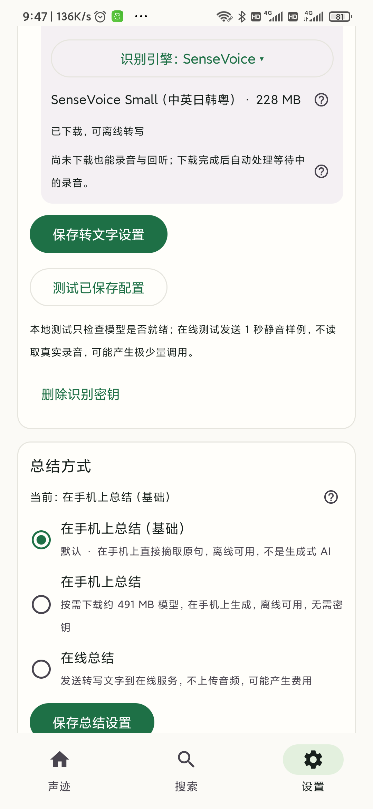
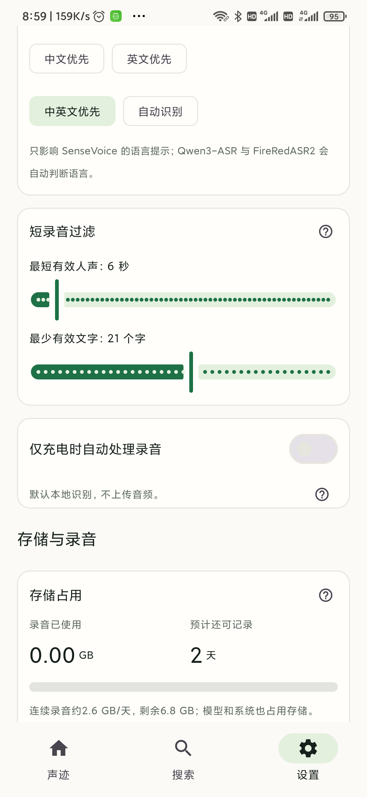

# 声迹 Sonfolio

**本地优先的 Android 语音记录：把持续录音整理成可以阅读、搜索和回听的对话时间线。**

[](https://github.com/gongfpp/Sonfolio/actions/workflows/android.yml)
[](LICENSE)

<p align="center">
  
</p>

声迹在后台持续录音，自动做语音检测与转写，把相邻语音合并成一场对话，再按日期整理成时间线。录音、识别和基础整理默认都在手机上完成，不需要账号或自建后端；外部识别和 AI 总结由你自行决定是否启用。

> 项目处于早期试用阶段（当前 `0.2.3`），「录音 → 转写 → 检索 → 回听」链路已跑通。全天后台运行、长期数据积累和本地 AI 总结仍在验证中，暂不建议作为重要记录的唯一保存方式。正式客户端位于 `android/`，仓库根目录的网页是交互原型。

## 界面预览

<p>
  
  
  
</p>

## 功能

- **持续录音**：前台服务录音，每 5 分钟保存一段，边录边处理；一场对话可以跨越多个文件。
- **对话时间线**：按日期回看对话主题、小结和一日回顾，卡片显示整理进度与状态。
- **对照回听**：在对话详情展开转写，点击某一行跳到对应录音；底部播放器可暂停续播、拖动进度。
- **回溯标记**：录音时按默认 3／10／20 分钟标记重点，整段连续对话高亮，并受压缩与清理保护。
- **搜索筛选**：关键词搜索标题与转写，按今天／本周／仅标记筛选，结果按每场对话聚合。
- **隐私优先**：默认本机处理、不上传音频；密钥用 Android Keystore 加密，应用禁用系统云备份。
- **数据可控**：转写后自动压缩录音，可设保留期；支持完整备份的导出与恢复。

## 安装与开始使用

支持 **Android 10 及以上、arm64-v8a 设备**，暂无正式 Release 安装包，可从源码构建 Debug APK。

需要 Git、Git LFS、JDK 17，以及 Android SDK Platform 35、NDK `29.0.14206865`、CMake `3.31.6`（可在 Android Studio 中打开 `android/` 配置）。首次构建需联网获取依赖和固定版本的 llama.cpp，VAD／ASR 模型通过 Git LFS 获取。

```bash
git clone https://github.com/gongfpp/Sonfolio.git
cd Sonfolio
git lfs install && git lfs pull
cd android
./gradlew :app:assembleDebug
adb install -r app/build/outputs/apk/debug/app-debug.apk
```

首次打开请允许麦克风权限。在「设置 → 转文字方式」下载本地模型，或选择外部识别提供商并确认音频上传；没有模型也能先录音和回听。不同手机的后台限制不同，长时间使用前先确认锁屏后仍在采集。

## 转文字与总结

两者独立选择：可以本地转写、外部总结，也可以外部转写、本地整理。常用提供商无需手填接口地址，API Key 字段下方可直达官方创建页面。

| 转文字方式 | 需要准备 | 音频去向 |
| --- | --- | --- |
| 手机本地识别（默认） | 下载本地引擎：SenseVoice（约 228 MB）、Qwen3-ASR 0.6B（约 987 MB）或 FireRedASR2-CTC（约 776 MB） | 本机离线处理，不上传 |
| 外部 API 识别 | 选择通义千问／硅基流动／豆包（火山引擎）及语音模型，填入密钥并确认上传 | 本机先检测人声，再把短人声片段发送给提供商，可能产生费用 |

| 总结方式 | 需要准备 | 数据去向 |
| --- | --- | --- |
| 本地基础整理（默认） | 无 | 手机本地，提取式规则 |
| 手机本地 AI | 下载约 491 MB 的 Qwen2.5-0.5B GGUF | 手机本地离线 |
| 外部 API | 选择 DeepSeek／通义千问／OpenCode Go 和模型，填入 API Key 并确认发送文字 | 仅发送转写文字与必要上下文，不上传音频 |

模型不打进 APK，统一下载到应用私有 `files/models/` 目录，每个文件先做 SHA-256 校验后才会启用；识别与总结模型互不替换。外部识别只自动处理保存设置之后开始的录音，历史音频需在原始录音列表逐份确认；云端时间戳采用本地人声窗口，不是逐字对齐。每条小结都会标注来源和模型名，便于区分新旧结果。

## 隐私与存储

- 录音和转写保存在应用本地私有空间，不内置云端账户同步；应用已声明排除云备份与设备迁移。
- 默认本地识别不上传音频；外部识别需单独确认，外部总结需文字发送确认。两套 API Key 分开用 Android Keystore 加密，不写入数据导出。
- 原始录音为 16 kHz 单声道 PCM WAV，连续录音约占 2.6 GB／天；转写完成后自动压缩，可设永久保留或 7／30／90 天清理未压缩文件，标记附近不受影响。
- 可从设置导出／恢复完整备份（含录音、转写、标记、对话关系），不含 API Key、模型和个性化设置；备份文件目前未加密，请存放在可信位置。

## 项目状态与参与

当前重点是长时间录音的可靠性、历史数据增长下的整理与查询性能，以及录音管理和备份恢复。说话人识别、声纹定向识别、语义搜索和自然语言历史问答尚未实现，嘈杂环境的识别效果也在继续改进。

遇到问题欢迎在 [GitHub Issues](https://github.com/gongfpp/Sonfolio/issues) 提供机型、Android 版本、应用版本和复现步骤；请勿附上私人录音、完整转写或 API Key。

- 技术选型与架构：[docs/technical-selection.md](docs/technical-selection.md)
- 识别与总结质量评测：[docs/evaluation/README.md](docs/evaluation/README.md)
- 最新开发验收：[docs/开发验收-0.2.3.md](docs/开发验收-0.2.3.md)

客户端使用 Kotlin、Jetpack Compose、Room 和 WorkManager，语音链路采用 Silero VAD、SenseVoice／Qwen3-ASR／FireRedASR2 与 sherpa-onnx，本地生成式总结通过 llama.cpp。网页交互原型可在仓库根目录用 `python3 -m http.server 4173` 预览，仅作设计参考。

## 许可证

除另有明确许可声明的第三方内容外，声迹 Sonfolio 采用 **GNU GPL v3.0 only**（SPDX：`GPL-3.0-only`），完整条款见 [LICENSE](LICENSE)。你可以使用、修改和商用（包括收费分发）；分发修改版或衍生作品时，须继续按 GPL 授权，保留许可与版权声明并注明修改。

第三方代码、模型和运行库保留各自的许可证，不因本项目采用 GPL 而被重新许可；随应用提供的许可文本见 [assets/licenses](android/app/src/main/assets/licenses)，贡献方式与许可边界见 [CONTRIBUTING.md](CONTRIBUTING.md)。SenseVoice、Qwen3-ASR、FireRedASR2 等模型权重是可选下载的独立组件，各有独立许可（FunASR 模型许可／Apache-2.0），下载前会展示并要求接受。指定许可证不代表第三方许可与源码对应检查已经完成。
